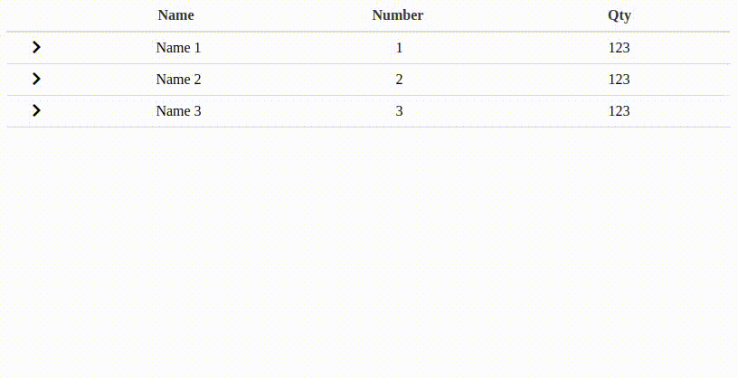

# Vue tree table

Vue tree table is a vue js table component, with a tree functionality.


## Install
```bash
yarn add vue-tree-table-codica
```

or

```bash
npm install vue-tree-table-codica
```

## Preview



## Register
```vue
import VSimpleTreeTable from 'vue-tree-table-codica'
import 'vue-tree-table-codica/dist/vue-simple-tree-table.css'

Vue.use(VSimpleTreeTable);
```

### Usage
You can add the vue-tree-table component by using the following code in your project.
This is the most simple example.

```vue
<template>
  <v-table :data="data" :columns="columns">
    <template v-slot:expand="row">
      <div>
        <div>NAME: {{row.props.name}}</div>
        <div>Number: {{row.props.number}}</div>
        <div>Qty: {{row.props.qty}}</div>
      </div>
    </template>
  </v-table>
</template>

export default {
  data() {
    return {
      columns: [
        {
          name: "Name",
          field: "name"
        },
        {
          name: "Number",
          field: "number"
        },
        {
          name: "Qty",
          field: "qty"
        }
      ],
      data: [
        {
          name: "Name 1",
          number: "1",
          qty: 123,
          hiddenData: "hiddenData 1",
          img: "https://dummyimage.com/300"
        },
        {
          name: "Name 2",
          number: "2",
          qty: 123,
          hiddenData: "hiddenData 2"
        },
        {
          name: "Name 3",
          number: "3",
          qty: 123,
          hiddenData: "hiddenData 3"
        }
      ]
    }
  }
}
```

## API

### Table Attributes

| Properties | Description | Type | Parameters | Default
| ---- | ---- | ---- | ---- | ---- |
| data | Data for each row of the table | Array | - | [] ||
| columns | Configuration of the columns in the table (see below for details)：Columns Configs） | Array | - | [] |


### Columns Configs

| Properties | Description | Type | Default |
| ---- | ---- | ---- | ---- |
| name | Column header name | String | '' |
| field | The attribute name of the corresponding column content | String | '' |

### Slot config

| Name | Description | Default | Required |
| ---- | ---- | ---- | ---- |
| expand | Content in expanded row | none | false |


## License
VSimpleTreeTable is Copyright © 2015-2019 Codica. It is released under the [MIT License](https://opensource.org/licenses/MIT).

## About Codica

[](https://www.codica.com)

VSimpleTreeTable is maintained and funded by Codica. The names and logos for Codica are trademarks of Codica.

We love open source software! See [our other projects](https://github.com/codica2) or [hire us](https://www.codica.com/) to design, develop, and grow your product.
